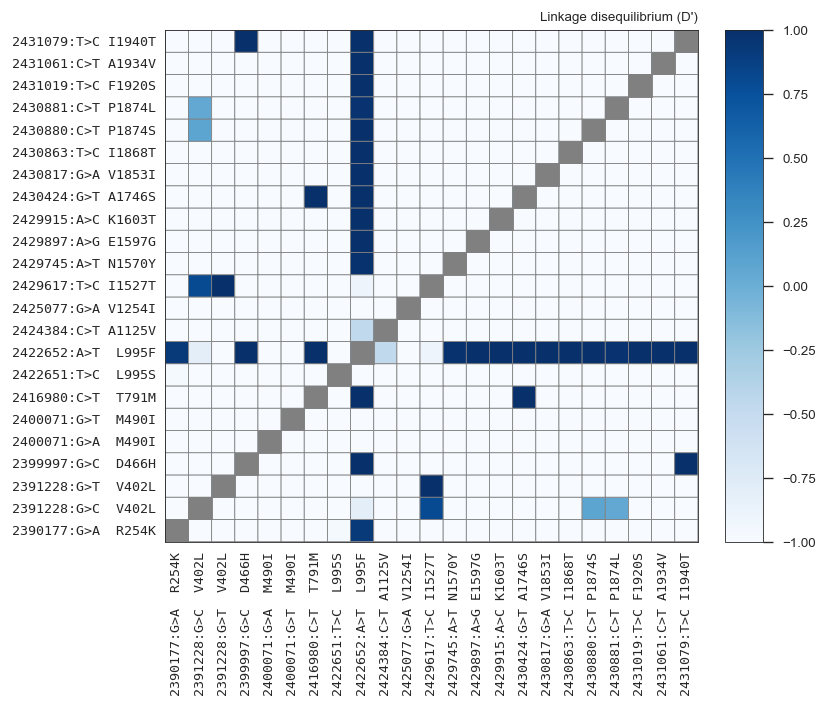

# Pairwise LD for functional SNPs

This notebook computes and plots pairwise LD between interesting functional SNPs.

## Setup


```python
%run setup.ipynb
%matplotlib inline
```


<style type="text/css">
.container {
    width: 100%;
}
div#notebook {
    padding-top: 1em;
}
#header-container {
    display: none;
}
#header-bar {
    display: none;
}
#maintoolbar {
    display: none;
}
#menubar-container {
    position: fixed;
    margin-top: 0;
}
#site {
    height: auto !important;
}
</style>


```python
# load in selected missense variants
tbl_variants_selected = etl.frompickle('../data/tbl_variants_missense_selected.pkl')
tbl_variants_selected.nrows()
```


    23


```python
# load in haplotypes
callset_haps = np.load('../data/haps_phase1.npz')
haps = allel.HaplotypeArray(callset_haps['haplotypes'])
pos = allel.SortedIndex(callset_haps['POS'])
pos.shape, haps.shape
```


    ((341998,), (341998, 1530))


```python
def lewontin_d_prime(h, i, j, a=1, b=1):
    """Compute LD between a pair of alleles.
    
    Parameters
    ----------
    h : array
        Haplotype array.
    i : int
        First variant index.
    j : int
        Second variant index.
    a : int
        First variant allele.
    b : int
        Second variant allele.
    
    Returns
    -------
    ld : float
    
    """
    
    # setup
    h = allel.HaplotypeArray(h)
    n_a = n_b = 0  # allele counts
    n_ab = 0  # haplotype counts
    n = 0  # allele number (i.e., number of calls)
    
    # iterate over haplotypes, counting alleles and haplotypes
    for k in range(h.n_haplotypes):
        
        # access alleles
        allele_ik = h[i, k]
        allele_jk = h[j, k]
        
        # only count if allele non-missing at both sites
        if allele_ik < 0 or allele_jk < 0:
            continue
            
        # accumulate
        if allele_ik == a:
            n_a += 1
        if allele_jk == b:
            n_b += 1
        if allele_ik == a and allele_jk == b:
            n_ab += 1
        n += 1
        
#     log('D_prime counts:', 'i', i, 'j', j, 'a', a, 'b', b, 'n', n, 'n_a', n_a, 'n_b', n_b)
        
    # bail out if no data or either allele is absent or fixed
    if n == 0 or n_a == 0 or n_b == 0 or n == n_a or n == n_b:
        return None
    
    # N.B., compute D prime using counts rather than frequencies to avoid floating-point errors
    # N.B., preserve the sign of D prime to retain information about linkage versus repulsion
    
    # compute coefficient of linkage disequilibrium * n**2
    D_ab = (n * n_ab) - (n_a * n_b)
    
    # compute normalisation coefficient * n**2
    if D_ab >= 0:
        D_max = min(n_a * (n - n_b), (n - n_a) * n_b)
    else:
        D_max = min(n_a * n_b, (n - n_a) * (n - n_b))

    # compute D prime
    D_prime = D_ab / D_max
    
#     log('D_prime', D_prime, i, j, a, b, n, n_a, n_b, D_ab, D_max)
#     if np.isnan(D_prime):
#         log('nan')
#        log(D_prime, i, j, a, b, n, n_a, n_b, D_ab, D_max)
        
    return D_prime

```


```python
pos_selected = allel.SortedIndex(sorted(tbl_variants_selected.values('POS').set()))
pos_selected
```


<div class="allel allel-DisplayAs1D"><span>&lt;SortedIndex shape=(21,) dtype=int32&gt;</span><table><thead><tr><th style="text-align: center">0</th><th style="text-align: center">1</th><th style="text-align: center">2</th><th style="text-align: center">3</th><th style="text-align: center">4</th><th style="text-align: center">...</th><th style="text-align: center">16</th><th style="text-align: center">17</th><th style="text-align: center">18</th><th style="text-align: center">19</th><th style="text-align: center">20</th></tr></thead><tbody><tr><td style="text-align: center">2390177</td><td style="text-align: center">2391228</td><td style="text-align: center">2399997</td><td style="text-align: center">2400071</td><td style="text-align: center">2416980</td><td style="text-align: center">...</td><td style="text-align: center">2430880</td><td style="text-align: center">2430881</td><td style="text-align: center">2431019</td><td style="text-align: center">2431061</td><td style="text-align: center">2431079</td></tr></tbody></table></div>


```python
tbl_variants_selected
```


<table class='petl'>
<thead>
<tr>
<th>0|CHROM</th>
<th>1|POS</th>
<th>2|num_alleles</th>
<th>3|REF</th>
<th>4|ALT</th>
<th>5|AC</th>
<th>6|ALTIX</th>
<th>7|FILTER_PASS</th>
<th>8|NoCoverage</th>
<th>9|LowCoverage</th>
<th>10|HighCoverage</th>
<th>11|LowMQ</th>
<th>12|HighMQ0</th>
<th>13|RepeatDUST</th>
<th>14|RepeatMasker</th>
<th>15|RepeatTRF</th>
<th>16|FS</th>
<th>17|HRun</th>
<th>18|QD</th>
<th>19|ReadPosRankSum</th>
<th>20|SNPEFF_Allele</th>
<th>21|SNPEFF_Annotation</th>
<th>22|SNPEFF_HGVS_c</th>
<th>23|SNPEFF_HGVS_p</th>
<th>24|SNPEFF_Feature_ID</th>
<th>25|SNPEFF_CDS_pos</th>
<th>26|AF_AOM</th>
<th>27|AF_BFM</th>
<th>28|AF_GWA</th>
<th>29|AF_GNS</th>
<th>30|AF_BFS</th>
<th>31|AF_CMS</th>
<th>32|AF_GAS</th>
<th>33|AF_UGS</th>
<th>34|AF_KES</th>
<th>35|check_allele</th>
<th>36|exon_start</th>
<th>37|exon_end</th>
<th>38|exon</th>
<th>39|AGAP004707-RA</th>
<th>40|AGAP004707-RB</th>
<th>41|AGAP004707-RC</th>
<th>42|Davies-C1N2</th>
<th>43|Davies-C3N2</th>
<th>44|Davies-C5N2</th>
<th>45|Davies-C7N2</th>
<th>46|Davies-C8N2</th>
<th>47|Davies-C10N2</th>
<th>48|Davies-C11N2</th>
<th>49|Davies-C1N9</th>
<th>50|Davies-C8N9</th>
<th>51|Davies-C1N9ck</th>
</tr>
</thead>
<tbody>
<tr>
<td>2L</td>
<td>2390177</td>
<td>2</td>
<td>G</td>
<td>A</td>
<td>198</td>
<td style='text-align: right'>0</td>
<td>True</td>
<td>0</td>
<td>3</td>
<td>8</td>
<td>0</td>
<td>0</td>
<td>False</td>
<td>False</td>
<td>False</td>
<td>0.12695</td>
<td>1</td>
<td>18.625</td>
<td>0.83496</td>
<td>A</td>
<td>missense_variant</td>
<td>n.761G>A</td>
<td>p.Arg254Lys</td>
<td>AGAP004707-RA</td>
<td>761</td>
<td style='text-align: right'>0.0</td>
<td style='text-align: right'>0.0</td>
<td style='text-align: right'>0.0</td>
<td style='text-align: right'>0.0</td>
<td style='text-align: right'>0.0</td>
<td style='text-align: right'>0.316363636364</td>
<td style='text-align: right'>0.214285714286</td>
<td style='text-align: right'>0.0</td>
<td style='text-align: right'>0.0</td>
<td>True</td>
<td style='text-align: right'>2390129</td>
<td style='text-align: right'>2390341</td>
<td>7</td>
<td>R254K</td>
<td>R254K</td>
<td>R254K</td>
<td>R260K</td>
<td>R217K</td>
<td>R260K</td>
<td>R260K</td>
<td>R271K</td>
<td>R260K</td>
<td>R260K</td>
<td>R260K</td>
<td>R271K</td>
<td>R260K</td>
</tr>
<tr>
<td>2L</td>
<td>2391228</td>
<td>3</td>
<td>G</td>
<td>C</td>
<td>10</td>
<td style='text-align: right'>0</td>
<td>True</td>
<td>0</td>
<td>0</td>
<td>12</td>
<td>0</td>
<td>0</td>
<td>False</td>
<td>False</td>
<td>False</td>
<td>2.0352</td>
<td>0</td>
<td>14.867</td>
<td>-1.1777</td>
<td>C</td>
<td>missense_variant</td>
<td>n.1204G>C</td>
<td>p.Val402Leu</td>
<td>AGAP004707-RA</td>
<td>1204</td>
<td style='text-align: right'>0.0</td>
<td style='text-align: right'>0.0724637681159</td>
<td style='text-align: right'>0.0</td>
<td style='text-align: right'>0.0</td>
<td style='text-align: right'>0.0</td>
<td style='text-align: right'>0.0</td>
<td style='text-align: right'>0.0</td>
<td style='text-align: right'>0.0</td>
<td style='text-align: right'>0.0</td>
<td>True</td>
<td style='text-align: right'>2391156</td>
<td style='text-align: right'>2391320</td>
<td>10</td>
<td>V402L</td>
<td>V402L</td>
<td>V402L</td>
<td>V408L</td>
<td>V365L</td>
<td></td>
<td>V408L</td>
<td>V419L</td>
<td>V408L</td>
<td>V408L</td>
<td>V408L</td>
<td>V419L</td>
<td>V408L</td>
</tr>
<tr>
<td>2L</td>
<td>2391228</td>
<td>3</td>
<td>G</td>
<td>T</td>
<td>9</td>
<td style='text-align: right'>1</td>
<td>True</td>
<td>0</td>
<td>0</td>
<td>12</td>
<td>0</td>
<td>0</td>
<td>False</td>
<td>False</td>
<td>False</td>
<td>2.0352</td>
<td>0</td>
<td>14.867</td>
<td>-1.1777</td>
<td>None</td>
<td>None</td>
<td>None</td>
<td>None</td>
<td>None</td>
<td>None</td>
<td style='text-align: right'>0.0</td>
<td style='text-align: right'>0.0652173913043</td>
<td style='text-align: right'>0.0</td>
<td style='text-align: right'>0.0</td>
<td style='text-align: right'>0.0</td>
<td style='text-align: right'>0.0</td>
<td style='text-align: right'>0.0</td>
<td style='text-align: right'>0.0</td>
<td style='text-align: right'>0.0</td>
<td>True</td>
<td style='text-align: right'>2391156</td>
<td style='text-align: right'>2391320</td>
<td>10</td>
<td>V402L</td>
<td>V402L</td>
<td>V402L</td>
<td>V408L</td>
<td>V365L</td>
<td></td>
<td>V408L</td>
<td>V419L</td>
<td>V408L</td>
<td>V408L</td>
<td>V408L</td>
<td>V419L</td>
<td>V408L</td>
</tr>
<tr>
<td>2L</td>
<td>2399997</td>
<td>2</td>
<td>G</td>
<td>C</td>
<td>38</td>
<td style='text-align: right'>0</td>
<td>True</td>
<td>0</td>
<td>1</td>
<td>7</td>
<td>0</td>
<td>0</td>
<td>False</td>
<td>False</td>
<td>False</td>
<td>13.359</td>
<td>0</td>
<td>15.688</td>
<td>0.11798</td>
<td>C</td>
<td>missense_variant</td>
<td>n.1396G>C</td>
<td>p.Asp466His</td>
<td>AGAP004707-RA</td>
<td>1396</td>
<td style='text-align: right'>0.0</td>
<td style='text-align: right'>0.0</td>
<td style='text-align: right'>0.0</td>
<td style='text-align: right'>0.0</td>
<td style='text-align: right'>0.0</td>
<td style='text-align: right'>0.0690909090909</td>
<td style='text-align: right'>0.0</td>
<td style='text-align: right'>0.0</td>
<td style='text-align: right'>0.0</td>
<td>True</td>
<td style='text-align: right'>2399898</td>
<td style='text-align: right'>2400173</td>
<td>11i+</td>
<td>D466H</td>
<td>D466H</td>
<td>D466H</td>
<td>D472H</td>
<td>D429H</td>
<td>D417H</td>
<td>D472H</td>
<td>D483H</td>
<td>D472H</td>
<td>D472H</td>
<td>D472H</td>
<td>D483H</td>
<td>D472H</td>
</tr>
<tr>
<td>2L</td>
<td>2400071</td>
<td>3</td>
<td>G</td>
<td>A</td>
<td>16</td>
<td style='text-align: right'>0</td>
<td>True</td>
<td>0</td>
<td>0</td>
<td>8</td>
<td>0</td>
<td>0</td>
<td>False</td>
<td>False</td>
<td>False</td>
<td>5.6875</td>
<td>0</td>
<td>16.969</td>
<td>1.3232</td>
<td>A</td>
<td>missense_variant</td>
<td>n.1470G>A</td>
<td>p.Met490Ile</td>
<td>AGAP004707-RA</td>
<td>1470</td>
<td style='text-align: right'>0.0</td>
<td style='text-align: right'>0.0</td>
<td style='text-align: right'>0.0</td>
<td style='text-align: right'>0.0</td>
<td style='text-align: right'>0.0</td>
<td style='text-align: right'>0.0</td>
<td style='text-align: right'>0.0</td>
<td style='text-align: right'>0.0</td>
<td style='text-align: right'>0.181818181818</td>
<td>True</td>
<td style='text-align: right'>2399898</td>
<td style='text-align: right'>2400173</td>
<td>11i+</td>
<td>M490I</td>
<td>M490I</td>
<td>M490I</td>
<td>M496I</td>
<td>M453I</td>
<td>M441I</td>
<td>M496I</td>
<td>M507I</td>
<td>M496I</td>
<td>M496I</td>
<td>M496I</td>
<td>M507I</td>
<td>M496I</td>
</tr>
</tbody>
</table>
<p><strong>...</strong></p>


```python
pos_selected.shape
```


    (21,)


```python
loc_selected = pos.locate_keys(pos_selected)
np.count_nonzero(loc_selected)
```


    21


```python
haps_selected = haps[loc_selected]
haps_selected
```


<div class="allel allel-DisplayAs2D"><span>&lt;HaplotypeArray shape=(21, 1530) dtype=int8&gt;</span><table><thead><tr><th></th><th style="text-align: center">0</th><th style="text-align: center">1</th><th style="text-align: center">2</th><th style="text-align: center">3</th><th style="text-align: center">4</th><th style="text-align: center">...</th><th style="text-align: center">1525</th><th style="text-align: center">1526</th><th style="text-align: center">1527</th><th style="text-align: center">1528</th><th style="text-align: center">1529</th></tr></thead><tbody><tr><th style="text-align: center; background-color: white; border-right: 1px solid black; ">0</th><td style="text-align: center">0</td><td style="text-align: center">0</td><td style="text-align: center">0</td><td style="text-align: center">0</td><td style="text-align: center">0</td><td style="text-align: center">...</td><td style="text-align: center">0</td><td style="text-align: center">0</td><td style="text-align: center">0</td><td style="text-align: center">0</td><td style="text-align: center">0</td></tr><tr><th style="text-align: center; background-color: white; border-right: 1px solid black; ">1</th><td style="text-align: center">0</td><td style="text-align: center">0</td><td style="text-align: center">2</td><td style="text-align: center">0</td><td style="text-align: center">0</td><td style="text-align: center">...</td><td style="text-align: center">0</td><td style="text-align: center">0</td><td style="text-align: center">0</td><td style="text-align: center">0</td><td style="text-align: center">0</td></tr><tr><th style="text-align: center; background-color: white; border-right: 1px solid black; ">2</th><td style="text-align: center">0</td><td style="text-align: center">0</td><td style="text-align: center">0</td><td style="text-align: center">0</td><td style="text-align: center">0</td><td style="text-align: center">...</td><td style="text-align: center">0</td><td style="text-align: center">0</td><td style="text-align: center">0</td><td style="text-align: center">0</td><td style="text-align: center">0</td></tr><tr><th style="text-align: center; background-color: white; border-right: 1px solid black; ">...</th><td style="text-align: center" colspan="12">...</td></tr><tr><th style="text-align: center; background-color: white; border-right: 1px solid black; ">18</th><td style="text-align: center">0</td><td style="text-align: center">0</td><td style="text-align: center">0</td><td style="text-align: center">0</td><td style="text-align: center">0</td><td style="text-align: center">...</td><td style="text-align: center">0</td><td style="text-align: center">0</td><td style="text-align: center">0</td><td style="text-align: center">0</td><td style="text-align: center">0</td></tr><tr><th style="text-align: center; background-color: white; border-right: 1px solid black; ">19</th><td style="text-align: center">0</td><td style="text-align: center">0</td><td style="text-align: center">0</td><td style="text-align: center">1</td><td style="text-align: center">0</td><td style="text-align: center">...</td><td style="text-align: center">0</td><td style="text-align: center">0</td><td style="text-align: center">0</td><td style="text-align: center">0</td><td style="text-align: center">0</td></tr><tr><th style="text-align: center; background-color: white; border-right: 1px solid black; ">20</th><td style="text-align: center">0</td><td style="text-align: center">0</td><td style="text-align: center">0</td><td style="text-align: center">0</td><td style="text-align: center">0</td><td style="text-align: center">...</td><td style="text-align: center">0</td><td style="text-align: center">0</td><td style="text-align: center">0</td><td style="text-align: center">0</td><td style="text-align: center">0</td></tr></tbody></table></div>


```python
ac = haps_selected.count_alleles()
ac.displayall()
```


<div class="allel allel-DisplayAs2D"><span>&lt;AlleleCountsArray shape=(21, 3) dtype=int32&gt;</span><table><thead><tr><th></th><th style="text-align: center">0</th><th style="text-align: center">1</th><th style="text-align: center">2</th></tr></thead><tbody><tr><th style="text-align: center; background-color: white; border-right: 1px solid black; ">0</th><td style="text-align: center">1332</td><td style="text-align: center"> 198</td><td style="text-align: center">   0</td></tr><tr><th style="text-align: center; background-color: white; border-right: 1px solid black; ">1</th><td style="text-align: center">1511</td><td style="text-align: center">  10</td><td style="text-align: center">   9</td></tr><tr><th style="text-align: center; background-color: white; border-right: 1px solid black; ">2</th><td style="text-align: center">1492</td><td style="text-align: center">  38</td><td style="text-align: center">   0</td></tr><tr><th style="text-align: center; background-color: white; border-right: 1px solid black; ">3</th><td style="text-align: center">1512</td><td style="text-align: center">  16</td><td style="text-align: center">   2</td></tr><tr><th style="text-align: center; background-color: white; border-right: 1px solid black; ">4</th><td style="text-align: center">1498</td><td style="text-align: center">  32</td><td style="text-align: center">   0</td></tr><tr><th style="text-align: center; background-color: white; border-right: 1px solid black; ">5</th><td style="text-align: center">1100</td><td style="text-align: center"> 430</td><td style="text-align: center">   0</td></tr><tr><th style="text-align: center; background-color: white; border-right: 1px solid black; ">6</th><td style="text-align: center"> 755</td><td style="text-align: center"> 775</td><td style="text-align: center">   0</td></tr><tr><th style="text-align: center; background-color: white; border-right: 1px solid black; ">7</th><td style="text-align: center">1519</td><td style="text-align: center">  11</td><td style="text-align: center">   0</td></tr><tr><th style="text-align: center; background-color: white; border-right: 1px solid black; ">8</th><td style="text-align: center">1525</td><td style="text-align: center">   5</td><td style="text-align: center">   0</td></tr><tr><th style="text-align: center; background-color: white; border-right: 1px solid black; ">9</th><td style="text-align: center">1511</td><td style="text-align: center">  19</td><td style="text-align: center">   0</td></tr><tr><th style="text-align: center; background-color: white; border-right: 1px solid black; ">10</th><td style="text-align: center">1420</td><td style="text-align: center"> 110</td><td style="text-align: center">   0</td></tr><tr><th style="text-align: center; background-color: white; border-right: 1px solid black; ">11</th><td style="text-align: center">1519</td><td style="text-align: center">  11</td><td style="text-align: center">   0</td></tr><tr><th style="text-align: center; background-color: white; border-right: 1px solid black; ">12</th><td style="text-align: center">1523</td><td style="text-align: center">   7</td><td style="text-align: center">   0</td></tr><tr><th style="text-align: center; background-color: white; border-right: 1px solid black; ">13</th><td style="text-align: center">1502</td><td style="text-align: center">  28</td><td style="text-align: center">   0</td></tr><tr><th style="text-align: center; background-color: white; border-right: 1px solid black; ">14</th><td style="text-align: center">1517</td><td style="text-align: center">  13</td><td style="text-align: center">   0</td></tr><tr><th style="text-align: center; background-color: white; border-right: 1px solid black; ">15</th><td style="text-align: center">1478</td><td style="text-align: center">  52</td><td style="text-align: center">   0</td></tr><tr><th style="text-align: center; background-color: white; border-right: 1px solid black; ">16</th><td style="text-align: center">1501</td><td style="text-align: center">  29</td><td style="text-align: center">   0</td></tr><tr><th style="text-align: center; background-color: white; border-right: 1px solid black; ">17</th><td style="text-align: center">1450</td><td style="text-align: center">  80</td><td style="text-align: center">   0</td></tr><tr><th style="text-align: center; background-color: white; border-right: 1px solid black; ">18</th><td style="text-align: center">1518</td><td style="text-align: center">  12</td><td style="text-align: center">   0</td></tr><tr><th style="text-align: center; background-color: white; border-right: 1px solid black; ">19</th><td style="text-align: center">1514</td><td style="text-align: center">  16</td><td style="text-align: center">   0</td></tr><tr><th style="text-align: center; background-color: white; border-right: 1px solid black; ">20</th><td style="text-align: center">1486</td><td style="text-align: center">  44</td><td style="text-align: center">   0</td></tr></tbody></table></div>


## Compute and plot pairwise LD


```python
def compute_ld():
    global ld
    recs = list(tbl_variants_selected.records())
    n = len(recs)
    ld = np.zeros((n, n), dtype='f8')
    for i in range(n):
        i_pos = recs[i].POS
        i_allele = recs[i].ALTIX + 1
        i_vidx = pos_selected.locate_key(i_pos)
        log('row', i, i_vidx, i_pos, i_allele)
        for j in range(i+1, n):
            j_pos = recs[j].POS
            j_allele = recs[j].ALTIX + 1
            j_vidx = pos_selected.locate_key(j_pos)
    #         log('col', j, j_vidx, j_pos, j_allele)
            v = lewontin_d_prime(haps_selected, i_vidx, j_vidx, i_allele, j_allele)
    #         log('D_prime', v)
            ld[i, j] = v
            ld[j, i] = v
        
    
compute_ld()
```

    row 0 0 2390177 1
    row 1 1 2391228 1
    row 2 1 2391228 2
    row 3 2 2399997 1
    row 4 3 2400071 1
    row 5 3 2400071 2
    row 6 4 2416980 1
    row 7 5 2422651 1
    row 8 6 2422652 1
    row 9 7 2424384 1
    row 10 8 2425077 1
    row 11 9 2429617 1
    row 12 10 2429745 1
    row 13 11 2429897 1
    row 14 12 2429915 1
    row 15 13 2430424 1
    row 16 14 2430817 1
    row 17 15 2430863 1
    row 18 16 2430880 1
    row 19 17 2430881 1
    row 20 18 2431019 1
    row 21 19 2431061 1
    row 22 20 2431079 1


```python
ld[11]
```


    array([-1.        ,  0.79748511,  1.        , -1.        , -1.        ,
           -1.        , -1.        , -1.        , -0.89609508, -1.        ,
           -1.        ,  0.        , -1.        , -1.        , -1.        ,
           -1.        , -1.        , -1.        , -1.        , -1.        ,
           -1.        , -1.        , -1.        ])


```python
def fig_pw_ld():

    fig = plt.figure(figsize=(7, 6), dpi=120)

    gs = mpl.gridspec.GridSpec(1, 2, width_ratios=[7, .5])

    # sns.despine(ax=ax, offset=5)
    #sns.heatmap(ld, vmin=-1, vmax=1, center=0, square=True, ax=ax, cmap='Blues', cbar_kws=dict(ticks=[-1, -.5, 0, .5, 1]))

    ax = fig.add_subplot(gs[0])
    im = ax.pcolormesh(ld, vmin=-1, vmax=1, cmap='Blues', shading='flat', edgecolors='gray', linewidths=.5, antialiased=True)

    labels = ['%s:%s>%s %s' % (rec.POS, rec.REF, rec.ALT, rec['AGAP004707-RA'].rjust(6))
              for rec in tbl_variants_selected.records()]
    # ax.invert_yaxis()
    ticks = np.arange(ld.shape[0]) + .5
    ax.set_xticks(ticks)
    ax.set_yticks(ticks)
    ax.set_xticklabels(labels, rotation=90, ha='center', va='top', fontdict=dict(family='monospace'))
    ax.set_yticklabels(labels, rotation=0, va='center', ha='right', fontdict=dict(family='monospace'));
    ax.set_xlim(0, ld.shape[0])
    ax.set_ylim(0, ld.shape[0])
    ax.xaxis.set_tick_params(length=0)
    ax.yaxis.set_tick_params(length=0)
    for i in range(ld.shape[0] + 1):
        ax.add_patch(plt.Rectangle((i-1, i-1), 1, 1, color='gray'))
    ax.set_title("Linkage disequilibrium (D')", loc='right')

    cax = fig.add_subplot(gs[1])
    fig.colorbar(im, cax=cax)

    fig.tight_layout()
    fig.savefig('../artwork/fig_ld.png', dpi=300, bbox_inches='tight')
    

fig_pw_ld()
```





```python

```
