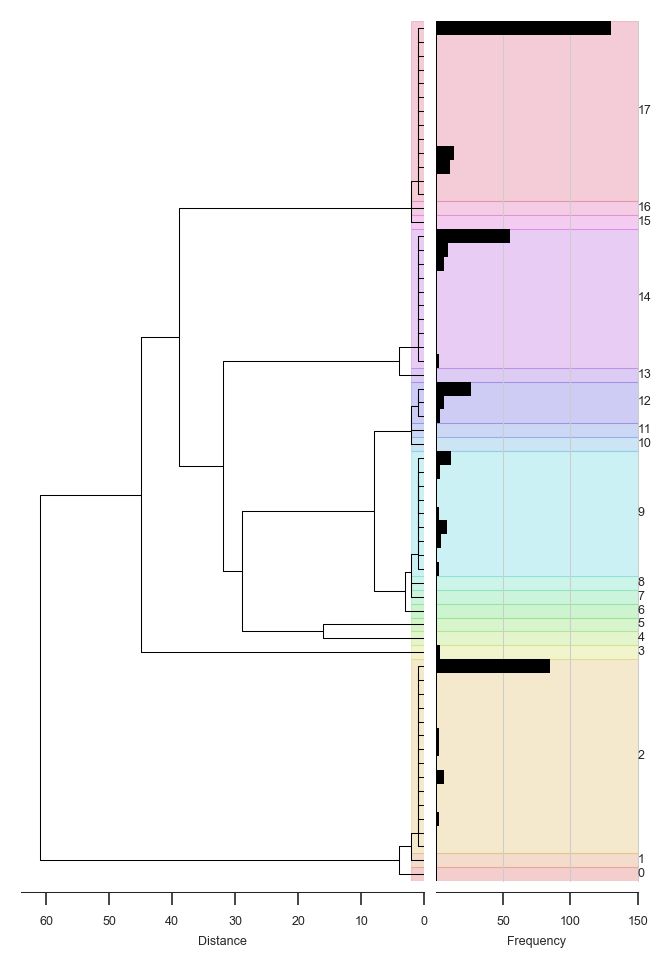
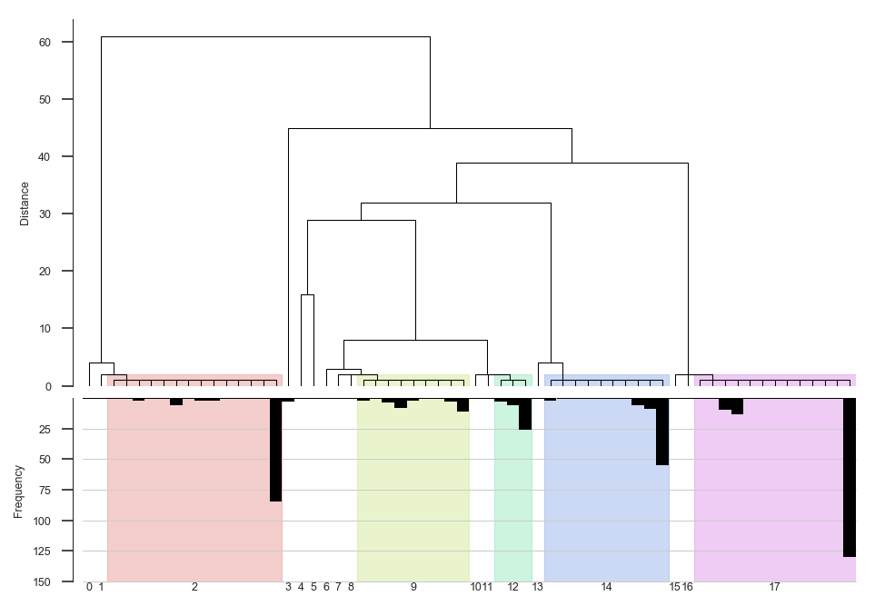
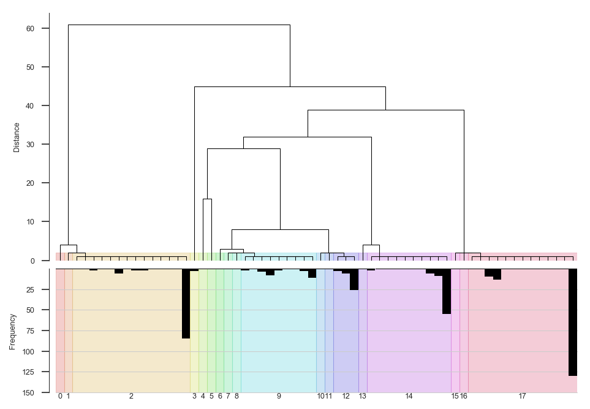
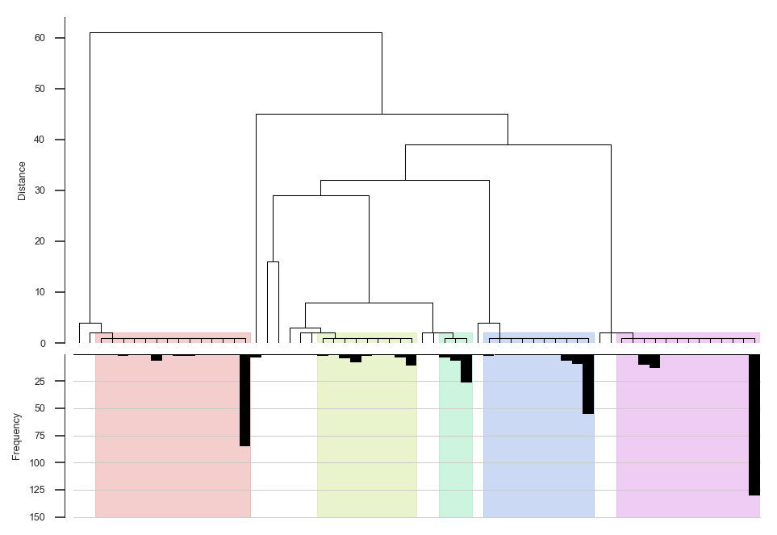
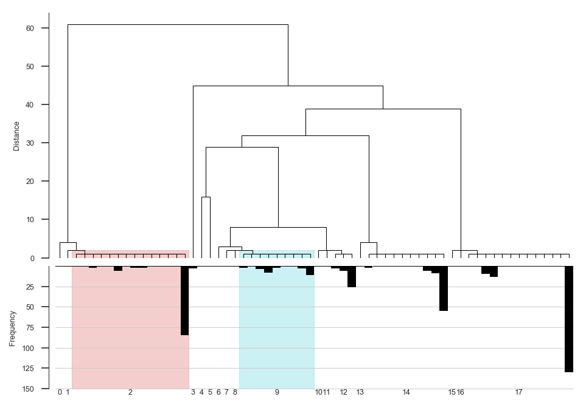
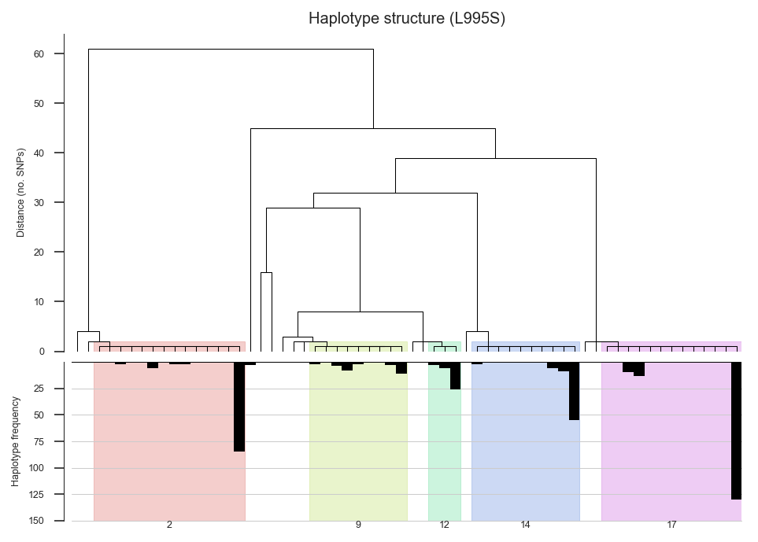

# Haplotype clustering demo

This notebook demonstrates how to use the haplotype clustering utilities.


```python
%run hapclust_utils.ipynb
```


<style type="text/css">
.container {
    width: 100%;
}
div#notebook {
    padding-top: 0;
}
#header-container {
    display: none;
}
#header-bar {
    display: none;
}
#maintoolbar {
    display: none;
}
#site {
    height: auto !important;
}
</style>


## Setup data


```python
callset = h5py.File('../data/ag1000g.phase1.AR3.1.haplotypes.specific_regions.2L_2358158_2431617.h5',
                    mode='r')
region_vgsc = SeqFeature('2L', 2358158, 2431617)
genotypes = allel.GenotypeArray(callset['2L/calldata/genotype'])
haplotypes = genotypes.to_haplotypes()
pos = allel.SortedIndex(callset['2L/variants/POS'])
loc = pos.locate_range(region_vgsc.start, region_vgsc.end)
h_vgsc = haplotypes[loc]
pos_995S = 2422651
pos_995F = 2422652
loc_995S = haplotypes[pos.locate_key(pos_995S)] == 1
loc_995F = haplotypes[pos.locate_key(pos_995F)] == 1
h_vgsc_995F = h_vgsc.compress(loc_995F, axis=1)
h_vgsc_995S = h_vgsc.compress(loc_995S, axis=1)
```

## Plot plot plot...


```python
# Default plot... 
# cuts the tree at height 2 (so max distance within each cluster is 1)...
# highlights all clusters...
# labels all clusters.
fig_haplotypes_clustered(h_vgsc_995S, dpi=150);
```


```python
# Change the orientation...
fig_haplotypes_clustered(h_vgsc_995S, orientation='left', dpi=150);
```


```python
# Try a different cut height...
fig_haplotypes_clustered(h_vgsc_995S, cut_height=5, dpi=150);
```





```python
# Choose to highlight only clusters above a certain size...
fig_haplotypes_clustered(h_vgsc_995S, dpi=150, highlight_clusters=5);
```





```python
# Manually choose which clusters to highlight...
fig_haplotypes_clustered(h_vgsc_995S, dpi=150, highlight_clusters=[2, 9]);
```





```python
# Turn off cluster labels...
fig_haplotypes_clustered(h_vgsc_995S, dpi=150, highlight_clusters=5, label_clusters=False);
```





```python
# Use your favourite colors...
fig_haplotypes_clustered(h_vgsc_995S, dpi=150, highlight_clusters=5, label_clusters=False, 
                         highlight_colors=['red', 'green', 'blue', 'cyan', 'magenta', 'yellow'],
                         highlight_alpha=.8);
```


## Return values


```python
# What does this function return?
fig, ax_dend, ax_freq, cluster_spans = fig_haplotypes_clustered(h_vgsc_995S, dpi=150, highlight_clusters=5, label_clusters=5)
```





```python
# E.g., customise axes...
fig, ax_dend, ax_freq, cluster_spans = fig_haplotypes_clustered(h_vgsc_995S, dpi=150, highlight_clusters=5, label_clusters=5)
ax_dend.set_title('Haplotype structure (L995S)')
ax_dend.set_ylabel('Distance (no. SNPs)')
ax_freq.set_ylabel('Haplotype frequency');
```





```python
# Cluster spans is most useful...
cluster_spans
```


    [(0, 1, array([85])),
     (1, 2, array([17])),
     (2,
      16,
      array([  0,   1,   3,   4,   5,   7,  11,  15,  16,  19,  21,  23,  25,
              28,  29,  33,  35,  36,  37,  38,  39,  40,  41,  42,  43,  45,
              47,  50,  51,  55,  57,  59,  61,  63,  64,  65,  71,  73,  75,
              77,  79,  82,  83,  86,  87,  88,  89,  91,  94,  95, 100, 101,
             103, 107, 109, 111, 114, 115, 119, 121, 122, 123, 126, 127, 128,
             129, 131, 133, 135, 137, 139, 140, 141, 144, 145, 147, 148, 149,
             151, 157, 158, 159, 163, 164, 165, 167, 169, 171, 172, 173, 176,
             177, 181, 183, 184, 185, 186, 187, 188, 189, 193, 195, 197, 199,
             201, 203])),
     (16, 17, array([277, 316, 346])),
     (17, 18, array([294])),
     (18, 19, array([369])),
     (19, 20, array([327])),
     (20, 21, array([278])),
     (21, 22, array([357])),
     (22,
      31,
      array([276, 282, 283, 284, 286, 287, 289, 291, 293, 299, 303, 304, 306,
             307, 311, 318, 320, 321, 322, 325, 326, 328, 330, 332, 336, 337,
             344, 345, 347, 349, 351, 352, 353])),
     (31, 32, array([274])),
     (32, 33, array([315])),
     (33,
      36,
      array([273, 275, 279, 280, 281, 285, 288, 290, 292, 296, 297, 298, 300,
             301, 302, 309, 310, 312, 313, 314, 317, 323, 324, 329, 331, 333,
             334, 335, 338, 339, 340, 342, 348, 350, 355])),
     (36, 37, array([403])),
     (37,
      47,
      array([295, 305, 308, 319, 341, 343, 354, 356, 358, 359, 360, 361, 362,
             363, 364, 365, 366, 367, 368, 370, 371, 372, 373, 374, 375, 376,
             377, 378, 379, 380, 381, 382, 383, 384, 385, 386, 387, 388, 389,
             390, 391, 392, 393, 394, 395, 396, 397, 398, 399, 400, 401, 402,
             404, 405, 406, 407, 408, 409, 410, 411, 412, 413, 414, 415, 416,
             417, 418, 419, 420, 421, 422, 423, 424, 425, 426, 427, 428, 429])),
     (47, 48, array([113])),
     (48, 49, array([228])),
     (49,
      62,
      array([  2,   6,   8,   9,  10,  12,  13,  14,  18,  20,  22,  24,  26,
              27,  30,  31,  32,  34,  44,  46,  48,  49,  52,  53,  54,  56,
              58,  60,  62,  66,  67,  68,  69,  70,  72,  74,  76,  78,  80,
              81,  84,  90,  92,  93,  96,  97,  98,  99, 102, 104, 105, 106,
             108, 110, 112, 116, 117, 118, 120, 124, 125, 130, 132, 134, 136,
             138, 142, 143, 146, 150, 152, 153, 154, 155, 156, 160, 161, 162,
             166, 168, 170, 174, 175, 178, 179, 180, 182, 190, 191, 192, 194,
             196, 198, 200, 202, 204, 205, 206, 207, 208, 209, 210, 211, 212,
             213, 214, 215, 216, 217, 218, 219, 220, 221, 222, 223, 224, 225,
             226, 227, 229, 230, 231, 232, 233, 234, 235, 236, 237, 238, 239,
             240, 241, 242, 243, 244, 245, 246, 247, 248, 249, 250, 251, 252,
             253, 254, 255, 256, 257, 258, 259, 260, 261, 262, 263, 264, 265,
             266, 267, 268, 269, 270, 271, 272]))]


```python
# E.g., cluster labelled "2" in the plot:
dend_start, dend_stop, hap_indices = cluster_spans[2]
```


```python
# These are positions in the dendrogram where the cluster starts and stops:
dend_start, dend_stop
```


    (2, 16)


```python
# These are the indices of the haplotypes in the cluster
hap_indices
```


    array([  0,   1,   3,   4,   5,   7,  11,  15,  16,  19,  21,  23,  25,
            28,  29,  33,  35,  36,  37,  38,  39,  40,  41,  42,  43,  45,
            47,  50,  51,  55,  57,  59,  61,  63,  64,  65,  71,  73,  75,
            77,  79,  82,  83,  86,  87,  88,  89,  91,  94,  95, 100, 101,
           103, 107, 109, 111, 114, 115, 119, 121, 122, 123, 126, 127, 128,
           129, 131, 133, 135, 137, 139, 140, 141, 144, 145, 147, 148, 149,
           151, 157, 158, 159, 163, 164, 165, 167, 169, 171, 172, 173, 176,
           177, 181, 183, 184, 185, 186, 187, 188, 189, 193, 195, 197, 199,
           201, 203])


```python
# How many haplotypes in the cluster?
len(hap_indices)
```


    106


```python
# N.B., these are relative to the haplotype array passed into the function.
# To extract only haplotypes in this cluster...
haps_in_cluster = h_vgsc_995S.take(hap_indices, axis=1)
haps_in_cluster
```


<div class="allel allel-DisplayAs2D"><span>&lt;HaplotypeArray shape=(1718, 106) dtype=int8&gt;</span><table><tr><th></th><th style="text-align: center">0</th><th style="text-align: center">1</th><th style="text-align: center">2</th><th style="text-align: center">3</th><th style="text-align: center">4</th><th style="text-align: center">...</th><th style="text-align: center">101</th><th style="text-align: center">102</th><th style="text-align: center">103</th><th style="text-align: center">104</th><th style="text-align: center">105</th></tr><tr><th style="text-align: center">0</th><td style="text-align: center">0</td><td style="text-align: center">0</td><td style="text-align: center">0</td><td style="text-align: center">0</td><td style="text-align: center">0</td><td style="text-align: center">...</td><td style="text-align: center">0</td><td style="text-align: center">0</td><td style="text-align: center">0</td><td style="text-align: center">0</td><td style="text-align: center">0</td></tr><tr><th style="text-align: center">1</th><td style="text-align: center">0</td><td style="text-align: center">0</td><td style="text-align: center">0</td><td style="text-align: center">0</td><td style="text-align: center">0</td><td style="text-align: center">...</td><td style="text-align: center">0</td><td style="text-align: center">0</td><td style="text-align: center">0</td><td style="text-align: center">0</td><td style="text-align: center">0</td></tr><tr><th style="text-align: center">2</th><td style="text-align: center">0</td><td style="text-align: center">0</td><td style="text-align: center">0</td><td style="text-align: center">0</td><td style="text-align: center">0</td><td style="text-align: center">...</td><td style="text-align: center">0</td><td style="text-align: center">0</td><td style="text-align: center">0</td><td style="text-align: center">0</td><td style="text-align: center">0</td></tr><tr><th style="text-align: center">...</th><td style="text-align: center" colspan="12">...</td></tr><tr><th style="text-align: center">1715</th><td style="text-align: center">0</td><td style="text-align: center">0</td><td style="text-align: center">0</td><td style="text-align: center">0</td><td style="text-align: center">0</td><td style="text-align: center">...</td><td style="text-align: center">0</td><td style="text-align: center">0</td><td style="text-align: center">0</td><td style="text-align: center">0</td><td style="text-align: center">0</td></tr><tr><th style="text-align: center">1716</th><td style="text-align: center">0</td><td style="text-align: center">0</td><td style="text-align: center">0</td><td style="text-align: center">0</td><td style="text-align: center">0</td><td style="text-align: center">...</td><td style="text-align: center">0</td><td style="text-align: center">0</td><td style="text-align: center">0</td><td style="text-align: center">0</td><td style="text-align: center">0</td></tr><tr><th style="text-align: center">1717</th><td style="text-align: center">0</td><td style="text-align: center">0</td><td style="text-align: center">0</td><td style="text-align: center">0</td><td style="text-align: center">0</td><td style="text-align: center">...</td><td style="text-align: center">0</td><td style="text-align: center">0</td><td style="text-align: center">0</td><td style="text-align: center">0</td><td style="text-align: center">0</td></tr></table></div>


```python

```
